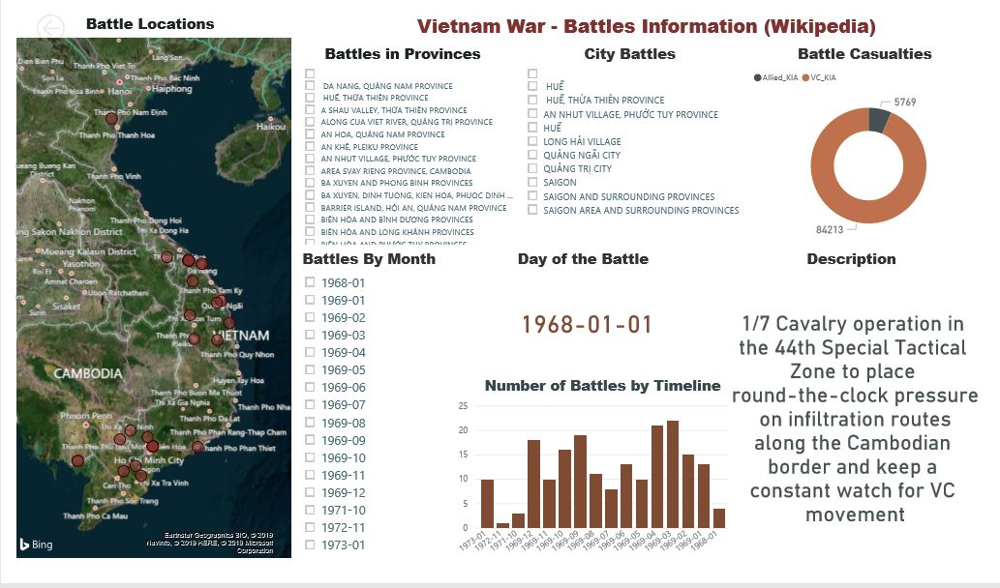
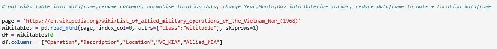

# Vietnam-War-Info-Wiki
<h1> Report</h1>

Below is an image of a Power BI Dashboard that I created(File - Vietnam.pbix). The data was obtained from Wikipedia using web scrapping. The concept behind the Dashboard was to create a document that would be able to able to give an overview of each battle that occurred during the Vietnam War. This includes :

<ul> 
  <li>The location of the Battle</li>
  <li>A Searchable Timeline </li>
  <li>A Breakdown of Regional and City Battles</li>
  <li>An Account of the Causalities for each Battle </li>
  <li> A Description of each Battle.</li>
  <li> The exact Time of each Battle. </li>
</ul>

Figure 1 - Final Dashboard 

  
<h1> Getting the Data and Cleaning it up </h1>

The full code that was created to collect and clean the data can be found in the file "Python_code.ipynb". Below I will quickly explain the steps that I took to get the data. 

<h2> Webscrapping the Data</h2>
I used Pandas and its read_html tool to upload the data from Wikipedia into a Pandas dataframe.

